# GigaСhat Vision: Тестовое задание

Я сделал как генерацию описаний, так и редактирование изображений.  
Описания генерируются через Qwen2.5-VL-3B-Instruct. Qwen2.5-VL-7B-Instruct влез в память, но работал мучительно медленно.  
Редактирование изображений производится через InstructPix2Pix. Qwen-Image-Edit не влез в память.

## Этапы

1. **Input generation (`src/generate_input.py`):**
    * **Стриминг** датасета [**Conceptual Captions**](https://huggingface.co/datasets/google-research-datasets/conceptual_captions) с HuggingFace (не скачивая весь датасет на диск).
    * Фильтрация валидных URL-ов изображений.
2. **Image Downloading (`src/download_images.py`):**
    * Асинхронная загрузка (`aiohttp` + `asyncio`) с контролем конкурентности (`Semaphore`).
    * Унифицированные и уникальные имена файлов через SHA1 хэш URL-ов.
    * Валидация картинок по Content-Type.
3. **Caption generation (`src/generate_captions.py`):**
    * Использование **Qwen2.5-VL-3B-Instruct** для генерации описаний.
    * Сохранение результата в формате **JSONL**.
4. **Image editing (`src/edit_images.py`):**
    * Редактирование изображений по текстовому описанию с помощью **InstructPix2Pix**.

## Как запустить

Весь процесс автоматизирован через Makefile.

### 1. Стандартный запуск (5 картинок, стиль Ван Гога)

Скачает 5 картинок, опишет их через Qwen и перерисует в стиле Ван Гога:

```bash
make run
```

Используемый датасет с URL-ами изображений уже старенький и примерно 1/3 картинок в итоге оказывается недоступной. Так что 5 URL-ов на входе не обязательно дадут 5 картинок на выходе.

### 2. Кастомный запуск

Обработать 10 картинок и сделать их в стиле киберпанка:

```bash
make run N=10 PROMPT="Make it look like a cyberpunk city with neon lights"
```

### 3. Очистка

Удалить все скачанные данные, логи и виртуальное окружение:

```bash
make clean
make clean-venv
```

## Что можно улучшить

Для 100-1000 картинок, это решение работает достаточно хорошо. Но для больших объемов данных, можно улучшить:

1. **Проблема RAM:**  
    Сейчас `download_images.py` держит весь список задач (URL-ов) в памяти. Для огромного количества значений это может быть критично.  
    *Решение:* Читать CSV построчно и закидывать задачи в очередь.

2. **Хранение:**  
    Сейчас все данные хранятся локально, в обычной файловой системе.  
    *Решение:* Метаданные можно хранить в базе данных, а изображения в S3.

3. **Оркестрация:**  
    Сейчас запустить процесс можно только локально через Makefile.  
    *Решение:* Airflow

4. **Повторные попытки скачивания (retry):**  
    Сейчас при падении запроса к URL картинка помечается как неудачная и больше не запрашивается. В данном случае это не критично. Если нужно больше картинок, проще и быстрее увеличить `N`, чем ждать нескольких retry-ов ради мизерного прироста успешных загрузок.  
    *Решение:* Автоматические retry с экспоненциальной задержкой и максимальным числом попыток.

## Демо

Директории `/data` и `/logs` были намеренно удалены из `.gitignore` для демонстрации работы.

<table>
<tr>
<td width="50%"></td>
<td width="50%">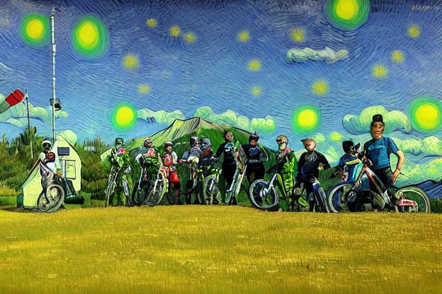</td>
</tr>
</table>

<p><em>The image depicts a group of mountain bikers standing together on a paved road, likely at the start or end of a ride. The background features a scenic mountain landscape with a prominent, snow-capped mountain under a clear blue sky. The riders are wearing helmets and protective gear, indicating they are prepared for a challenging ride. Some of them are holding their bikes, while others have them propped up against the ground. The overall atmosphere suggests an outdoor adventure and camaraderie among the bikers.</em></p>

<hr>

<table>
<tr>
<td width="50%"></td>
<td width="50%">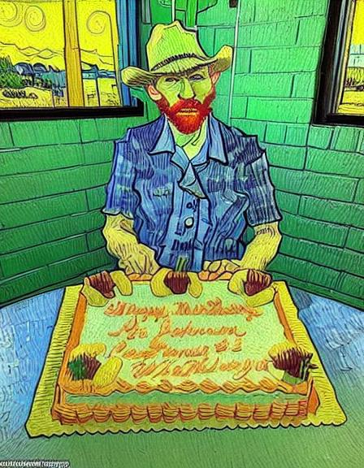</td>
</tr>
</table>

<p><em>The image shows an older man sitting at a table, smiling and holding a rectangular cake in front of him. The cake is decorated with orange and yellow icing, and it has the following text written on it:

\`\`\`
Happy Birthday
St. Johnson
Customer #1
Whataburger
\`\`\`

The man is wearing a white cowboy hat and a plaid shirt. He appears to be in a casual setting, possibly a restaurant or a similar establishment, as suggested by the background which includes a window and some outdoor elements visible through it.

The cake seems to be a celebratory item, likely for the man's birthday, given the</em></p>

<hr>

<table>
<tr>
<td width="50%"></td>
<td width="50%">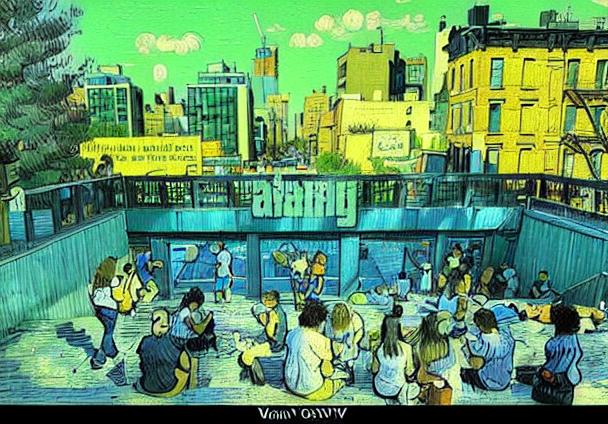</td>
</tr>
</table>

<p><em>The image depicts an urban scene featuring a group of people sitting and standing on a concrete platform, which appears to be part of a pedestrian bridge or overpass. The setting is likely in a city with a mix of modern and older architectural styles.

In the background, there is a cityscape with several tall buildings, including both high-rise residential and commercial structures. The buildings vary in design, with some having glass facades and others featuring brick exteriors. The sky is clear with a few scattered clouds, indicating a sunny day.

On the platform, there are numerous individuals engaged in various activities such as sitting, talking, and looking around</em></p>

<hr>

<table>
<tr>
<td width="50%"></td>
<td width="50%">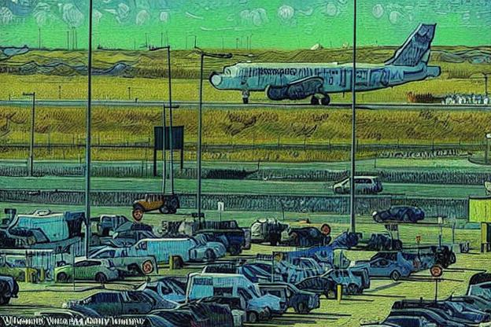</td>
</tr>
</table>

<p><em>The image depicts an airport scene with several key elements visible:

1. **Airplane**: A large commercial airplane is prominently positioned in the foreground, taking off or landing on the runway. The aircraft has a white fuselage with blue and red accents on its tail fin. The plane's landing gear is extended, indicating it is either preparing for takeoff or has recently landed.

2. **Runway and Taxiways**: The runway stretches horizontally across the image, with taxiways running parallel to it. These taxiways are used by ground vehicles such as airplanes, trucks, and maintenance equipment to move around the airport.

3. **Ground Vehicles</em></p>

<hr>

<table>
<tr>
<td width="50%"></td>
<td width="50%">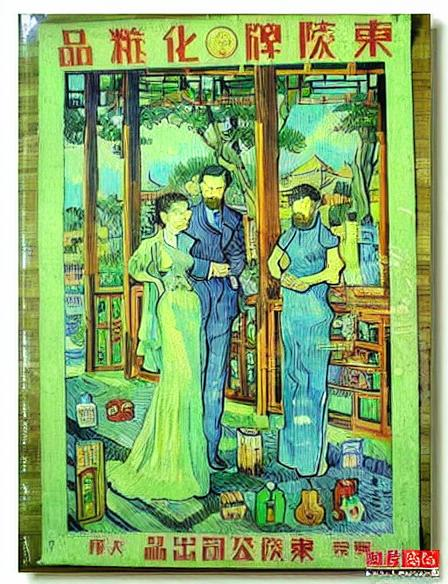</td>
</tr>
</table>

<p><em>The image is an old advertisement poster featuring a couple dressed in traditional Chinese attire, standing in what appears to be a garden or courtyard setting. The man is wearing a dark suit with a white shirt and tie, while the woman is dressed in a light green dress with a matching shawl. Both individuals have their hands clasped together, suggesting a formal or intimate moment.

In the background, there are several other people, some of whom are also dressed in traditional Chinese clothing. The scene includes traditional Chinese architecture, with a prominent building that has a tiled roof and ornate decorations. There are also trees and plants visible, adding to the serene</em></p>

<hr>

<table>
<tr>
<td width="50%"></td>
<td width="50%">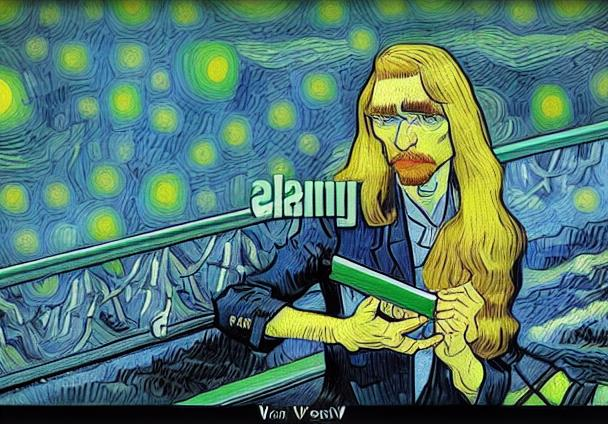</td>
</tr>
</table>

<p><em>The image depicts a young woman with long blonde hair, wearing glasses and a black blazer over a white shirt. She is holding a red folder in her left hand and a tablet device in her right hand. The background shows an outdoor setting with greenery and a metal railing, suggesting she might be in a park or a similar public space. The overall scene conveys a professional or academic context.</em></p>

<hr>

<table>
<tr>
<td width="50%"></td>
<td width="50%">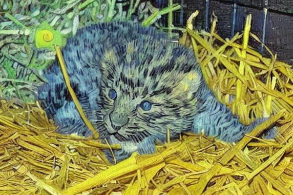</td>
</tr>
</table>

<p><em>The image depicts a young feline, likely a kitten, nestled among dry hay or straw. The kitten has distinctive markings typical of a wild cat species, such as a leopard or jaguar, with a spotted coat pattern. Its eyes are wide open and appear to be blue, which is unusual for wild cats but could indicate that the kitten is domesticated or in a controlled environment. The kitten's fur is soft and fluffy, and it seems to be resting comfortably on the hay. The background is somewhat blurred, focusing attention on the kitten.</em></p>

<hr>

<table>
<tr>
<td width="50%"></td>
<td width="50%">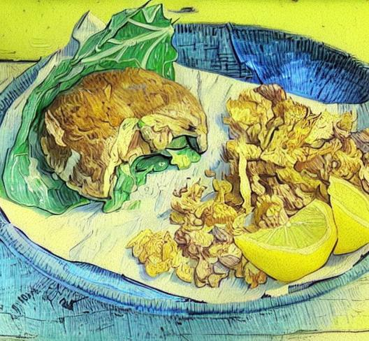</td>
</tr>
</table>

<p><em>The image depicts a meal served on a blue ceramic plate with a white interior. The plate is placed on a wooden surface, which appears to be a table or countertop.

On the left side of the plate, there is a piece of dark brown bread that has been split open and filled with various ingredients. The bread looks like it could be a baguette or a similar type of crusty bread. Inside the bread, there are visible pieces of green leafy vegetables, possibly lettuce or spinach, and some other ingredients that are not clearly identifiable but appear to be fresh and possibly include some herbs or spices.

To the right of the</em></p>

<hr>

<table>
<tr>
<td width="50%"></td>
<td width="50%">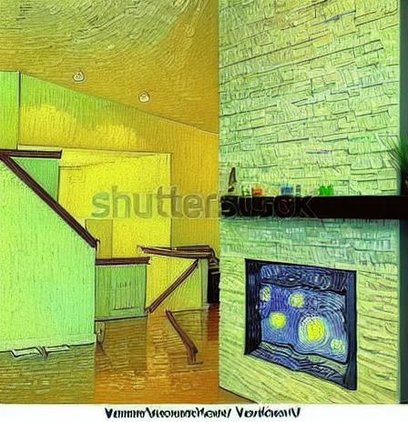</td>
</tr>
</table>

<p><em>This image depicts a modern, well-lit living room with a focus on a fireplace. The room features a clean, minimalist design with light-colored walls and a polished wooden floor.

Key elements in the image include:

1. **Fireplace**: The central feature is a large, modern fireplace with a white brick or stone surround. The fireplace is lit, with visible flames inside.
2. **Staircase**: To the left of the fireplace, there is a staircase leading to an upper level. The staircase has a simple, dark wooden railing.
3. **Lighting**: The room is illuminated by recessed lighting in the ceiling</em></p>

<hr>

<table>
<tr>
<td width="50%"></td>
<td width="50%">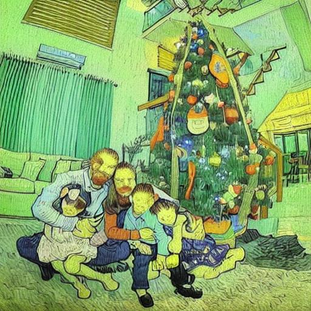</td>
</tr>
</table>

<p><em>The image shows a family of four posing in front of a decorated Christmas tree. The father is on the left, holding his daughter who is wearing a pink dress with a bow. The mother is sitting next to them, and her son is sitting on her lap. The Christmas tree is adorned with various ornaments, including a small flag and some colorful decorations. The room has a modern design with a large window, a staircase, and a comfortable-looking sofa in the background.</em></p>

<hr>

<table>
<tr>
<td width="50%"></td>
<td width="50%">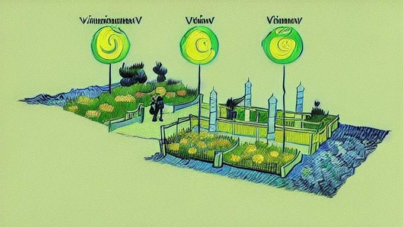</td>
</tr>
</table>

<p><em>This image illustrates different types of plants that can be used in a garden or landscape design, specifically adapted to withstand various water levels and conditions. The three main categories depicted are:

1. **Inundation Tolerant**: This category includes plants that can tolerate being submerged in water for extended periods. They are typically found in areas where the soil is saturated with water, such as near water bodies or in flood-prone areas.

2. **Emergent**: These plants are adapted to grow above the water level but are not fully submerged. They are often found in shallow water bodies like ponds, lakes, or wetlands.

3. **</em></p>

<hr>

<table>
<tr>
<td width="50%"></td>
<td width="50%">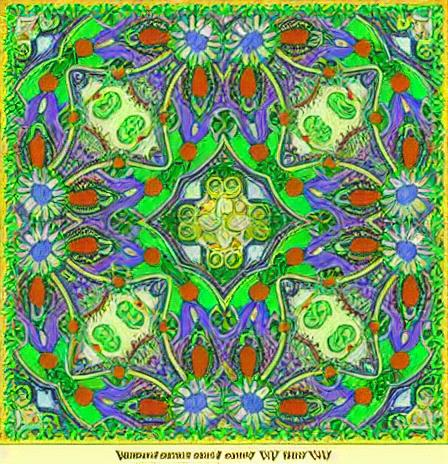</td>
</tr>
</table>

<p><em>The image is a vibrant and intricate pattern that appears to be inspired by traditional or folk art styles. The design features a variety of colorful elements, including flowers, leaves, and geometric shapes. The colors used are predominantly green, red, blue, yellow, and purple, creating a lively and eye-catching effect. The pattern is symmetrical and repetitive, with each element seamlessly blending into the next, forming a cohesive and harmonious overall design. The style suggests it could be used as a decorative element in textiles, wallpaper, or other decorative arts.</em></p>

<hr>

<table>
<tr>
<td width="50%"></td>
<td width="50%">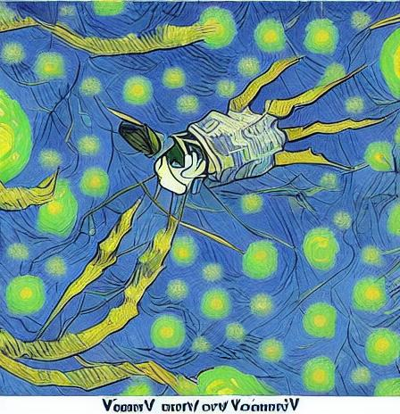</td>
</tr>
</table>

<p><em>The image depicts a robotic hand against a solid blue background. The hand is designed with a metallic and sleek appearance, featuring multiple joints and fingers that suggest advanced mechanical capabilities. The wrist area appears to be connected to a white cylindrical arm, which could imply a prosthetic or robotic limb. The overall design suggests a high level of technological sophistication, likely intended for use in applications such as robotics, artificial intelligence, or advanced prosthetics.</em></p>

<hr>

<table>
<tr>
<td width="50%"></td>
<td width="50%"></td>
</tr>
</table>

<p><em>The image is a vintage-style illustration featuring a floral design with the text "ROYAL LILY" prominently displayed in the center. The background is a solid pink color, and the illustration itself is in black and white, giving it an elegant and classic appearance.

Key elements of the image include:

1. **Floral Design**: The illustration is framed by a wreath of lilies, with each lily detailed with intricate petals and leaves.
2. **Text Elements**:
   * At the top, there is a small decorative flourish above the text "FRAME CARD."
   * Below that, the text reads "CLASSIC I</em></p>

<hr>

<table>
<tr>
<td width="50%"></td>
<td width="50%">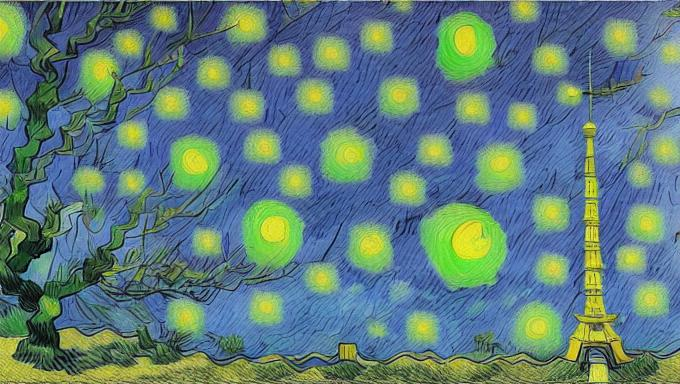</td>
</tr>
</table>

<p><em>The image depicts a flagpole with a flag flying against a clear blue sky. The flag is white with a red square in the center, which is characteristic of the Polish flag. The flag is attached to a tall pole and is waving in the wind. In the foreground, there is a tree with bare branches, indicating that it might be late autumn or winter. The background shows a few scattered clouds, adding depth to the sky. The overall scene suggests a calm and serene day with good weather conditions.</em></p>

<hr>

<table>
<tr>
<td width="50%"></td>
<td width="50%">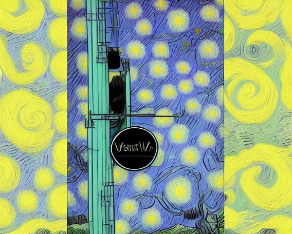</td>
</tr>
</table>

<p><em>The image shows a sign hanging from the side of a building. The sign reads "COFFEE BAR" in bold, uppercase letters. The background is a clear blue sky with some bare tree branches visible at the bottom right corner of the image. The sign is attached to the building with a chain and a metal bracket. There is also a small red sign with white text on the left side of the image, but the text on it is not clearly legible. The overall scene appears to be an outdoor setting, possibly in a small town or village.</em></p>

<hr>

<table>
<tr>
<td width="50%"></td>
<td width="50%"></td>
</tr>
</table>

<p><em>The image depicts a group of soccer players celebrating a goal during a match. The players are wearing red jerseys with white accents, and the number 14 is visible on one player's jersey. The player in the center appears to be the main focus of the celebration, as he is being embraced by his teammates.

In the background, there are several other players, some of whom are also wearing red jerseys, indicating they are part of the same team. One player in the background is holding a trophy, suggesting that the team has won a significant match or tournament. The trophy is silver and rectangular, with a ribbon tied around it.

</em></p>

<hr>

<table>
<tr>
<td width="50%"></td>
<td width="50%">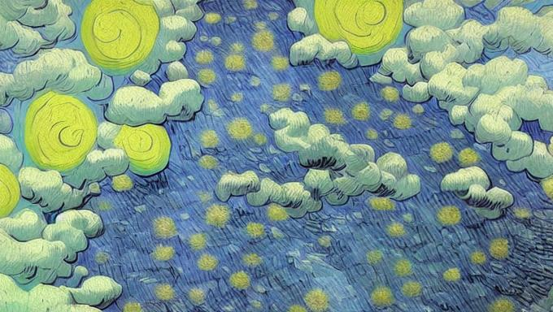</td>
</tr>
</table>

<p><em>The image depicts a winter scene with a small stream flowing through a snowy landscape. The stream is partially frozen, with ice forming on the surface and around the edges of the water. The banks of the stream are covered in snow, and there are large chunks of ice floating on the water. The overall atmosphere is cold and serene, typical of a winter day.</em></p>

<hr>

<table>
<tr>
<td width="50%"></td>
<td width="50%">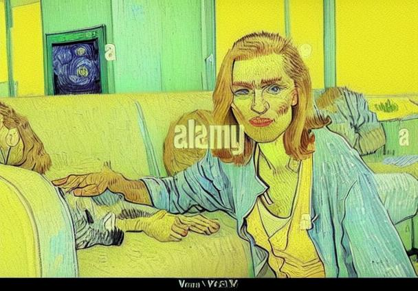</td>
</tr>
</table>

<p><em>The image depicts an older woman with light-colored hair, wearing a light blue cardigan over a peach-colored top. She is sitting on a white couch in what appears to be a living room. The woman is smiling and looking directly at the camera. On the couch next to her, there is a small dog lying down, appearing relaxed and comfortable. The background includes a fireplace and large windows that let in natural light, creating a cozy and warm atmosphere. The overall scene suggests a peaceful and content moment between the woman and her pet.</em></p>

<hr>
